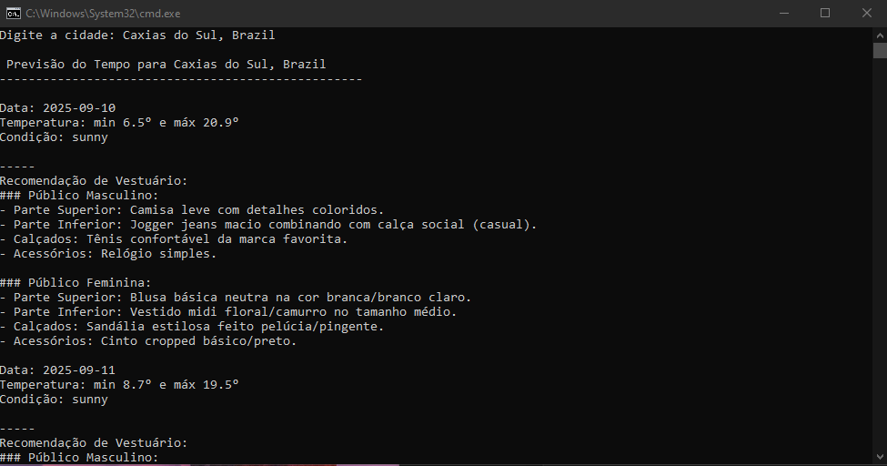

# Recomendação de Vestuário Baseado no Clima com IA

Este projeto consiste em interagir com o usuário para receber sua cidade, buscar a previsão do tempo para três dias e alimentar um modelo de IA com essa informação para que ele gere uma recomendação de vestuário masculino e feminino para cada um dos dias. 

## Tecnologias Utilizadas

- Linguagem de programação: Python;
- API's: GeoDB Cities, Weather API;
- Testes: Postman;
- Modelo de IA: Qwen/Qwen2.5-1.5B-Instruct;
- Bibliotecas:
    - streamlit;
    - prompt_toolkit;
    - requests;
    - transformers;
    - torch.

## Instruções de Utilização

### Pré-requisitos

- **Python**: Para execução do código;
- **Git**: Para baixar o projeto do GitHub.

### Configurando o Ambiente

- 1º Abra o terminal e clone o repositóri digitando: *git clone https://github.com/mauriciofalabretti/projeto_recomendacao_de_vestuario* ;
- 2º Navegue para a pasta do projeto com o comando:
*cd projeto_recomendacao_de_vestuario* ;
3º Crie um ambiente virtual digitando: *python -m venv .venv* ; 
- 4º Ative o ambiente virtual com o comando: *.venv\Scripts\activate* ;
- 5º Instale as bibliotecas com: *pip install -r requirements.txt* ;

### Autenticação para APIs

Para executar o projeto, é necessária a obtenção de tokens de acessar as API utilizadas.

**WeatherAPI**:

- 1º Acesse https://www.weatherapi.com;
- 2º Crie uma conta, cadastrando os dados solicitados;
- 3º Faça login e siga até o dashboard;
- 4º Procure pela seção "API Key", a chave é gerada automaticamente.
- 5º Após copiar a chave, acesse o terminal dentro da pasta do projeto;
- 6º Digite o seguinte comando para definir a variável de ambiente: *set WEATHER_API_KEY="cole aqui a chave de api copiada"* ; 

### Executando

**Para a versão do terminal**
- Dentro do terminal, com o ambiente virtual ativo, digite o comando: *python main.py* ;

**Para a versão de aplicação web (navegador)**
- Dentro do terminal, com o ambiente virtual ativo, digite: *streamlit run app_clima.py* 

#### Imagens

**Versão do terminal**

1º Mostra a entrada do usuário com a sugestão de cidades:

2º Mostra a previsão do tempo e o recomendação de vestuário feita pela IA:

3º Mostra o fim da execução:

---

**Versão aplicativo web (navegador)**

1º Mostra a entrada do usuário com a sugestão de cidades:

2º Mostra a previsão do tempo e o início das recomendações de vestuário:

3º Continua exibindo os resultados da execução:

4º Finalização da execução:

## Lições Aprendidas

Esse projeto surgiu da necessidade de uma abordagem hands-on, para que, através da construção eu pudesse reforçar conhecimentos que eu possuía e aprender conceitos novos.

Eu pensei em unir dados meteorológicos com a IA, criando um projeto que pudesse integrar a prática de consumo de APIs, organização de dados obtidos, testes em ferramentas como Postman, além da utilização de um modelo de inteligência artificial para gerar contéudo dinâmico, isso é, não depender de opções pré-determinadas baseadas em estruturas condicionais e sim, ter um poderio menos estático e mais natural.

Eu aprendi a importância da curadoria de um LLM, pois foram necessários diversos testes até encontrar um modelo que fosse adequado para a geração de texto fluído, natural e menos suscetível à alucinações. Também houve o aspecto de performance, uma vez que o modelo não poderia ser pesado ao ponto de tornar sua execução penosa.

Outro ponto de aprendizado e reforço foi o quão relevante é a utilização de comentários ao longo do código, pois, especialmente durante o uso de novos conceitos, os comentários ajudam a compreender e relembrar o que uma seção ou linha está fazendo e isso é fundamental para tornar o código manutenível.

Por fim, mas de modo algum menos importante, a elaboração da documentação é algo tão relevante quanto o código em si, pois ela nos faz revisitar o código e pensar em toda sua lógica e estrutura, o que amplia a nossa compreensão e permite criar documentos melhores.

Se você chegou até aqui, quero agradecer imensamente por sua atenção. Muitíssimo obrigado!